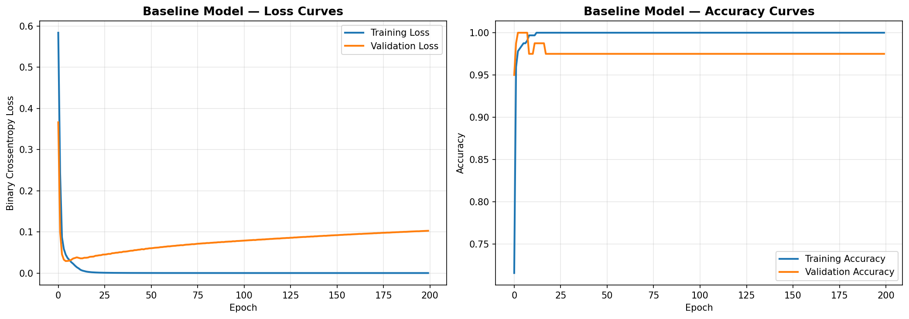
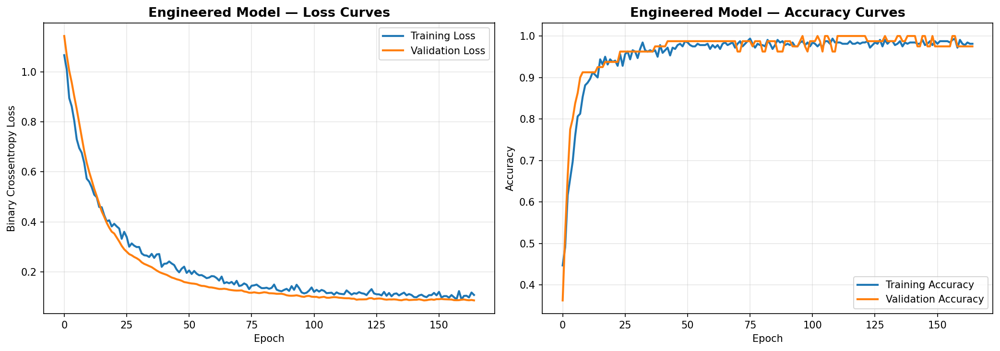
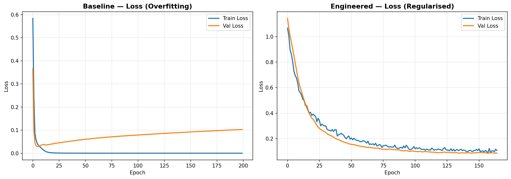
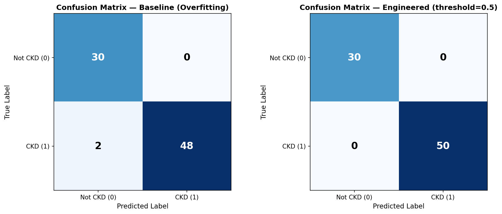
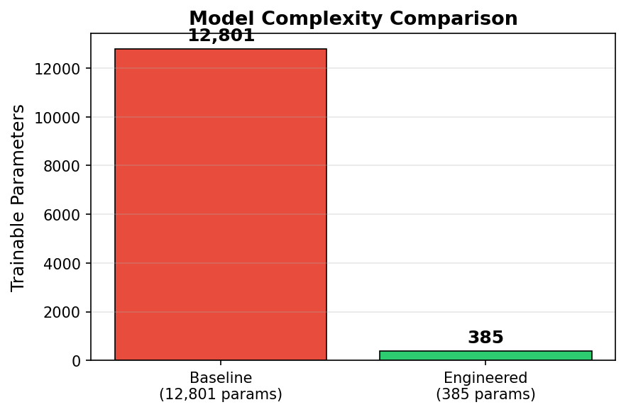
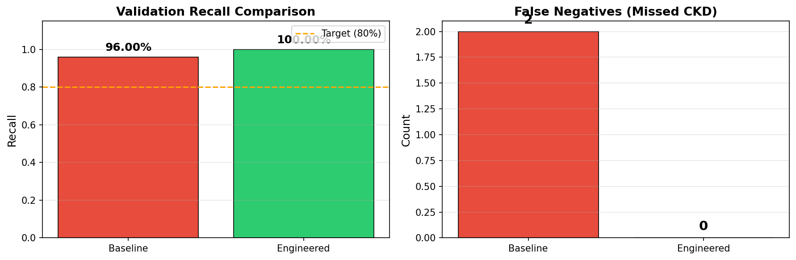

[](https://classroom.github.com/a/ENVI9wlT)

# Chronic Kidney Disease (CKD) Diagnostic Pipeline

**Student Name:** Mahmoud Mohamed Abdelfattah  
**Student ID:** 4220142

---

## Overview

A deep learning pipeline for Chronic Kidney Disease diagnosis using the [CKD Dataset](https://www.kaggle.com/datasets/mansoordaku/ckdisease) (~400 patients). The project demonstrates how an over-parameterised baseline model memorises the small dataset, then applies regularisation techniques (L2, Dropout, LeakyReLU, EarlyStopping) to build a clinically responsible model that generalises well.

| | Baseline | Engineered |
|---|---|---|
| **Parameters** | 12,801 | **385** |
| **Validation Accuracy** | 97.50% | **100%** |
| **Validation Recall** | 96.00% | **100%** |
| **False Negatives** | 2 | **0** |

---

## Project Structure

```
├── ckd_assignment.ipynb        # Main notebook (runs top-to-bottom)
├── dataset/
│   └── kidney_disease.csv      # CKD dataset (400 samples, 26 columns)
├── screenshots/                # All generated plots
│   ├── baseline_curves.png
│   ├── engineered_curves.png
│   ├── confusion_matrices.png
│   ├── loss_comparison.png
│   ├── parameter_comparison.png
│   └── metrics_comparison.png
└── README.md
```

---

## Task 1: Data Pipeline

- Loaded 400 samples with 26 columns
- Dropped all categorical columns → **14 numerical features**
- Fixed `pcv`, `wc`, `rc` columns (stored as strings in some rows)
- Median imputation for missing values
- Stratified 80/20 split (320 train / 80 validation)
- `StandardScaler` fit **only** on training data — **zero data leakage**

---

## Task 2: Engineered Failure (Baseline Model)

An intentionally over-parameterised Dense network (128 → 64 → 32 → 16 → 1) with **12,801 parameters** and **no regularisation**, trained for 200 epochs to demonstrate overfitting.

**Training loss → 0.0000 while validation loss diverges to 0.1027** — classic memorisation.



---

## Task 3: Clinical Solution (Engineered Model)

A small, regularised model (16 → 8 → 1) with:
- **L2 regularisation** (λ = 0.01) for weight shrinkage
- **Dropout** (p = 0.3) for stochastic regularisation
- **LeakyReLU** (α = 0.1) for gradient flow
- **EarlyStopping** (patience = 20, restore best weights)

Only **385 trainable parameters** — appropriate for ~320 training samples.



---

## Task 4: Evaluation & Comparison

### Loss Curves — Side by Side

Clear reduction in overfitting: the engineered model's training and validation curves converge, while the baseline's diverge.



### Confusion Matrices

The engineered model has **0 false negatives** — no missed CKD diagnoses.



### Model Complexity

33x parameter reduction from baseline to engineered model.



### Recall & False Negatives

Engineered model achieves **100% Recall** (target was >80%), with **0 false negatives** vs baseline's 2.



---

## Mathematical Justification

**Final Parameter Count:** 385

With only 385 trainable parameters for 320 training samples (a ~1.2:1 ratio), the model's hypothesis space is tightly constrained, while L2 regularisation (λ‖**w**‖²) acts as a continuous weight-shrinkage penalty that reduces the effective capacity below the nominal parameter count, and Dropout (p=0.3) provides stochastic regularisation by randomly zeroing activations during training to break neuron co-adaptation — together these techniques bound the Rademacher complexity of the learned function class, mathematically preventing memorisation of the ~400-patient dataset.

---

## How to Run

```bash
# Open the notebook and run all cells top-to-bottom
jupyter notebook ckd_assignment.ipynb
```

**Requirements:** Python 3.12, TensorFlow 2.19, scikit-learn, pandas, numpy, matplotlib

---

## Original Assignment

* **Dataset**: Chronic Kidney Disease Dataset (Kaggle)
* **URL**: `https://www.kaggle.com/datasets/mansoordaku/ckdisease`
* **Clinical Context**: You are working with a highly constrained dataset (n=400). An over-parameterised model will memorise the training data rather than learning generalised markers for CKD.

### Tasks
1. **Data Pipeline**: Load CSV, drop categorical columns, keep numerical features, handle NaNs, scale appropriately, 80/20 split.
2. **The Engineered Failure**: Build a baseline Dense network that overfits. Plot training/validation curves.
3. **The Clinical Solution**: Build a regularised model that prevents memorisation.
4. **Evaluation**: Compare both models. Optimise for Recall — missing a CKD diagnosis is clinically unacceptable.

### Submission Requirements
* **Visual Proof**: Training/validation curves demonstrating reduction in overfitting.
* **Confusion Matrices**: Proving reduction in False Negatives.
* **Clinical Benchmark**: Engineered model must achieve >80% Recall.
* **Mathematical Justification**: Parameter count + one-sentence explanation.
